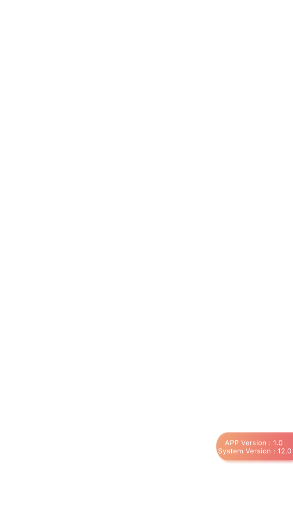
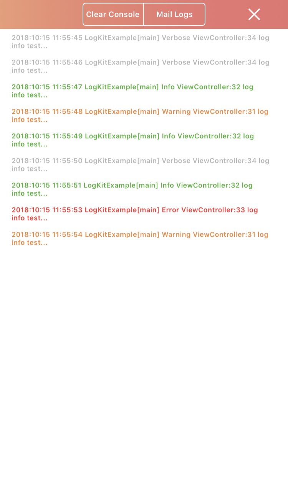
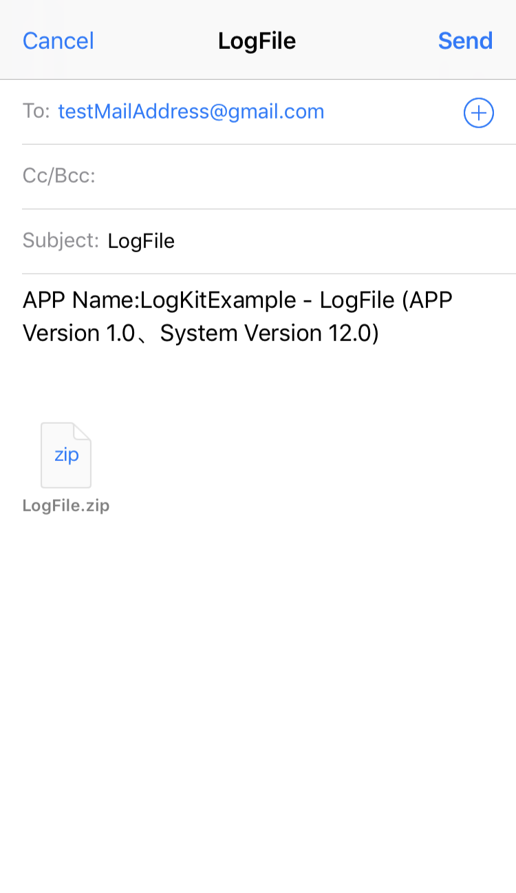
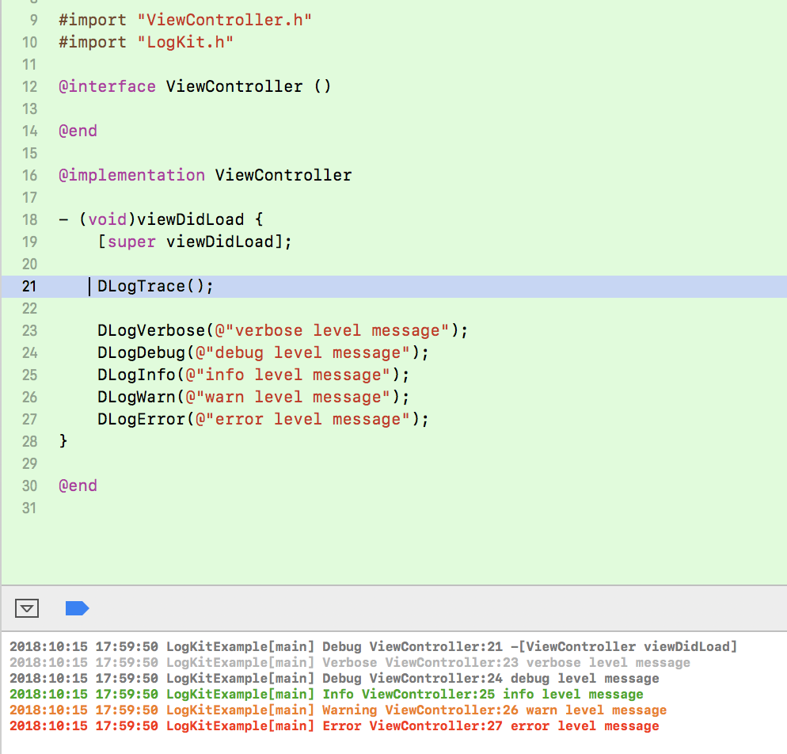

# LogKit

Log framework based on [CocoaLumberjack][3] and [ZipArchive][4]

## Features
- Easy to test and collect problems that are difficult to reproduce,we can send logs to mailBox without Xcode
- Output different log information with corresponding colors in the Xcode console or iPhone depending on the log level(Xcode console required[__XcodeColors__][2] plug-in)

## Preview
assistiveButton  | debugView | logMail | XcodeConsole |
-----|-----|-----|-----|
 |  |  |  |

## Configuration
Configuration Settings in project's AppDelegate.m

```obj-c
 // #import 'LogKit.h' 
 // #import <LogKit.h>
 
- (BOOL)application:(UIApplication *)application didFinishLaunchingWithOptions:(NSDictionary *)launchOptions {
    [LogKit addTTYLogger];		// Configure and add a DDTTYLogger (Apple System Log and Xcode console)
    
    [LogKit addFileLogger];		// Send the log to the file (default for non debug builds),requied this method if you want send log files to mail
    
#ifdef DEBUG
    [LogKit addDashboardLogger];		//  Configure and add a recorder with console logs
#endif
    
    [LogKit setDefaultMailAddress:@[@"testMailAddress@gmail.com"]];		// Sets the mailbox collection that receives log files (default is empty)
    
    [LogKit setDefaultLogPassword:@"101001"];		// Set the password for the log file (default is empty)
    
    return YES;
}
```

## Installation
```ruby
source 'https://github.com/CocoaPods/Specs.git'

pod 'CocoaLogKit'
// pod 'CocoaLumberjack'
// pod 'SSZipArchive'
```

## License
`LogKit`use [__MIT license__][1]

[1]: https://github.com/skooal/LogKit/LICENSE "MIT License"
[2]: https://github.com/robbiehanson/XcodeColors "XcodeColors"
[3]: https://github.com/CocoaLumberjack/CocoaLumberjack "CocoaLumberjack"
[4]: https://github.com/ZipArchive/ZipArchive "ZipArchive"