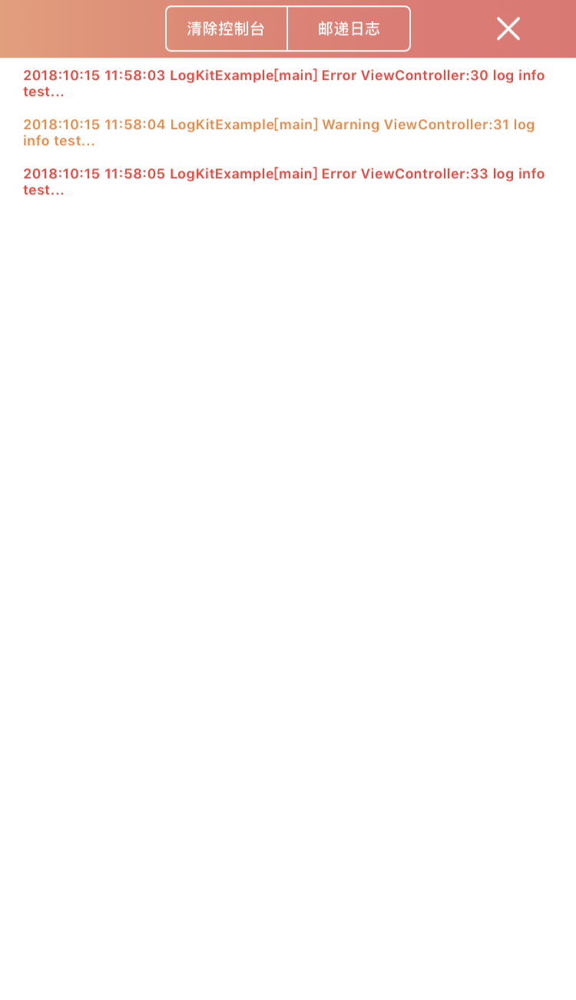
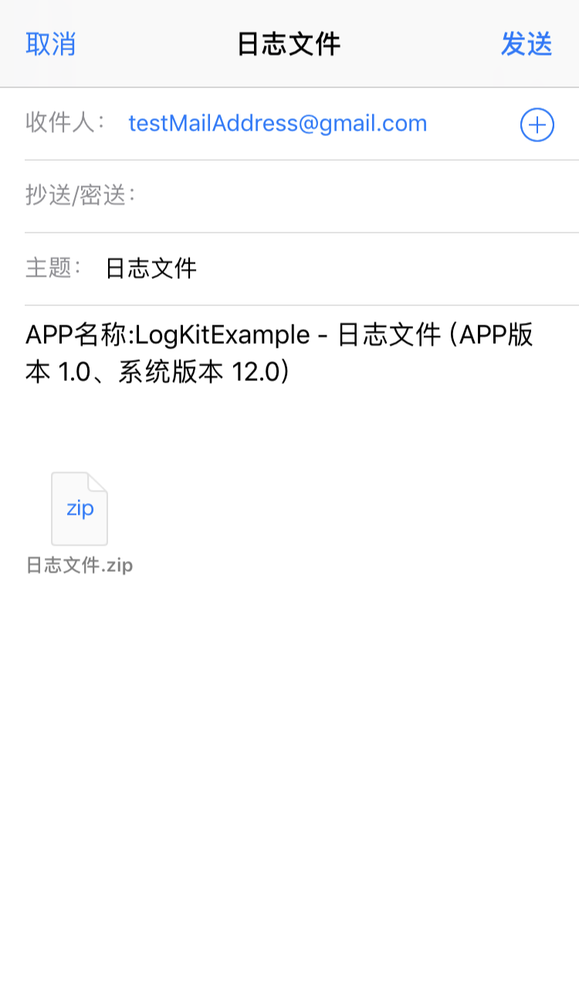

# LogKit

基于[CocoaLumberjack][3]和[ZipArchive][4]的日志框架

## 功能
- 易于测试和收集应用的日志信息或是难以重现的问题，我们可以在离开Xcode的情况下将日志发送到邮箱
- 根据日志级别，在Xcode控制台或iPhone中输出不同颜色的日志信息(若要在Xcode控制台输出不同的颜色则依赖[__XcodeColors__][2]插件)

## 预览
辅助按钮  | 调试视图 | 发送日志 | Xcode控制台 |
-----|-----|-----|-----|
 |  |  |  |

## 配置
在项目AppDelegate.m中进行框架配置

```obj-c
 // #import 'LogKit.h' 
 // #import <LogKit.h>
 
- (BOOL)application:(UIApplication *)application didFinishLaunchingWithOptions:(NSDictionary *)launchOptions {
    [LogKit addTTYLogger];		// 配置并添加一个DDTTYLogger(苹果系统日志和Xcode控制台)
    
    [LogKit addFileLogger];		// 把日志语句发送至文件 (默认情况下为非调试版本添加的注释),如果需要发送日志文件到邮箱的功能则需要此方法
    
#ifdef DEBUG
    [LogKit addDashboardLogger];		// 配置并添加一个带有调试视图的日志控制台 (如果只需要在Xcode下调试可不添加此行)
#endif
    
    [LogKit setDefaultMailAddress:@[@"testMailAddress@gmail.com"]];		// 设置接收压缩日志文件的邮箱集合 (默认为空)
    
    [LogKit setDefaultLogPassword:@"101001"];		// 设置日志文件的解压密码 (默认为空)
    
    return YES;
}
```
## 安装
```ruby
source 'https://github.com/CocoaPods/Specs.git'
use_frameworks!

pod 'LogKit'
// pod 'CocoaLumberjack'
// pod 'SSZipArchive'
```

## 开源许可
`LogKit`use [__MIT license__][1]

[1]: https://github.com/skooal/LogKit/LICENSE "MIT License"
[2]: https://github.com/robbiehanson/XcodeColors "XcodeColors"
[3]: https://github.com/CocoaLumberjack/CocoaLumberjack "CocoaLumberjack"
[4]: https://github.com/ZipArchive/ZipArchive "ZipArchive"